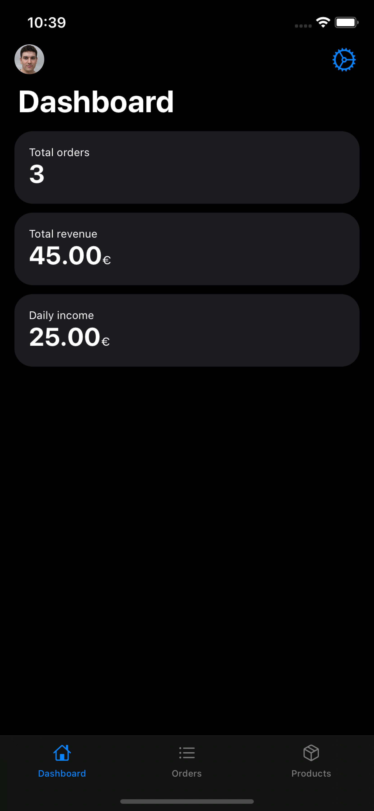
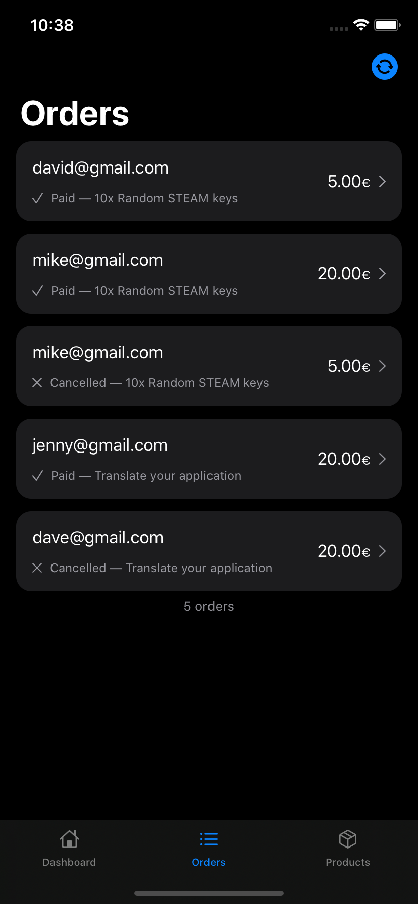
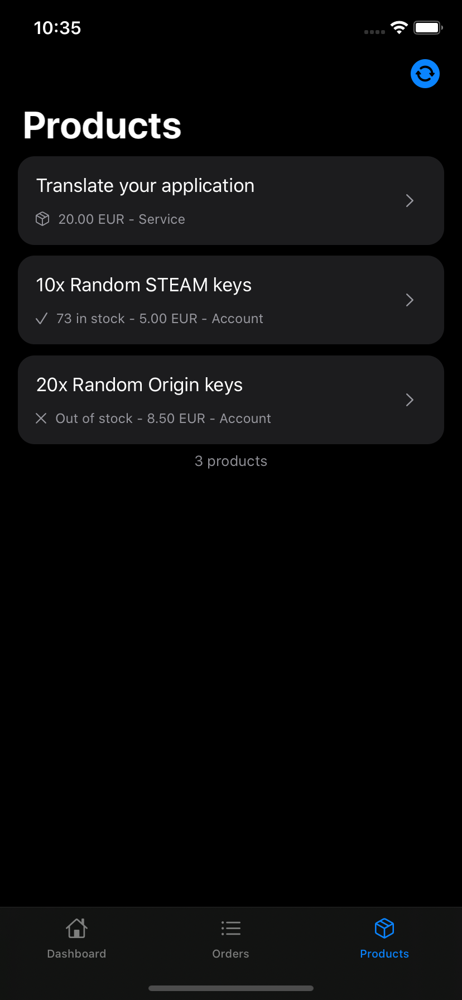

# Shoppy iOS Client
> Shoppy is an unofficial alternative client for [shoppy.gg iOS application](https://apps.apple.com/fr/app/shoppy-ecommerce/id1486173778?l=en) present on the iOS App Store. I decided to make this alternative because the official application was slow, bugged and not using the full power of the proposed API.

## Install
_I'll try to launch it on App Store as soon as application reach version 1.2!_ You can take a look to projects to see what's remaining.

## Screenshots
> Here are a couple of screenshots, the applications contains a lot more to see, use it by yourself to discover everything!

| Home | Orders | Products |
|:----:|:------:|:--------:|
|  |  |  |

Others screenshots are available in **`Media`** folder.

## Features compared to official application
| Features | Official | Unofficial Shoppy-iOS |
|:--------:|:--------:|:---------------------:|
| Home analytics | Partial | ✅ ([Charts planned for 1.2](https://github.com/vlourme/Shoppy-iOS/projects/2)) |
| Orders list | ✅ | ✅ |
| Orders detail | ❌ | ✅ |
| Product list | ❌ | ✅ |
| Product details | ❌ | ✅ |
| Profile and Settings | ❌ | ✅ |
| Manage products | ❌ | ✅ |
| Feedbacks | ❌ | 🕐 [Planned for 1.2](https://github.com/vlourme/Shoppy-iOS/projects/2) |
| Queries | ❌ | 🕐 [Planned for 1.2](https://github.com/vlourme/Shoppy-iOS/projects/2) |
| [Nofifications](https://github.com/vlourme/Shoppy-iOS/issues/4) | ✅ | ❌ |
| Translations | ❌ | 🕐 [French planned for 1.2](https://github.com/vlourme/Shoppy-iOS/projects/2) |

## Progression
You can see progression, bug tracking and future features in [Projects](https://github.com/vlourme/Shoppy-iOS/projects)

## Libraries
- [SwiftyShoppy](https://github.com/vlourme/SwiftyShoppy) for Shoppy API wrapper
- [Moya](https://github.com/Moya/Moya) for API development
- [Keychain-Swift](https://github.com/evgenyneu/keychain-swift) for API key saving
- [MDText](https://github.com/Lambdo-Labs/MDText) for displaying Markdown text (experimental)